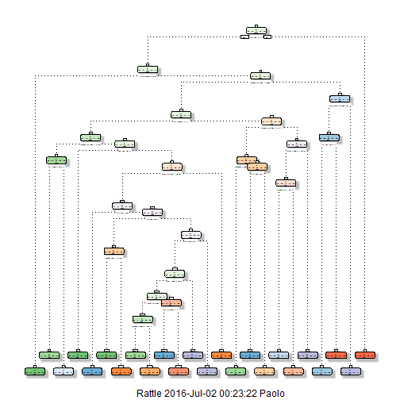
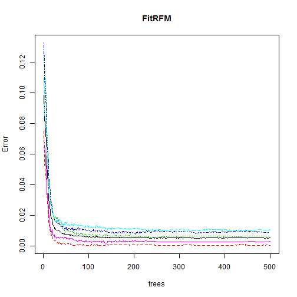
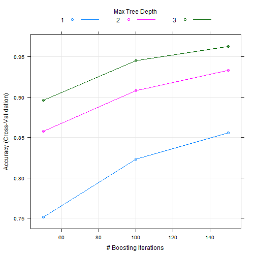

# Predict barbell lifts by employing Machine Learning
  + author: "Tozzi Fan"
  + date: "1 July 2016"
  
## 1. Synopsis
The data for this project come from this source: http://groupware.les.inf.puc-rio.br/har.The data has been download July 1 2016 at 23.21 am and saved without modification

## 2. Data Processing
### 2.1 Data loading
+ Required libraries 


```r
library(RCurl);library(AppliedPredictiveModeling); library(caret); library(ElemStatLearn); 
```

```
## Loading required package: bitops
```

```
## Warning: package 'AppliedPredictiveModeling' was built under R version
## 3.2.5
```

```
## Warning: package 'caret' was built under R version 3.2.5
```

```
## Loading required package: lattice
```

```
## Warning: package 'lattice' was built under R version 3.2.4
```

```
## Loading required package: ggplot2
```

```
## Warning: package 'ggplot2' was built under R version 3.2.5
```

```
## Warning: package 'ElemStatLearn' was built under R version 3.2.5
```

```r
library(pgmm); library(rpart); library(ElemStatLearn); library(gbm);
```

```
## Warning: package 'rpart' was built under R version 3.2.5
```

```
## Warning: package 'gbm' was built under R version 3.2.5
```

```
## Loading required package: survival
```

```
## 
## Attaching package: 'survival'
```

```
## The following object is masked from 'package:caret':
## 
##     cluster
```

```
## Loading required package: splines
```

```
## Loading required package: parallel
```

```
## Loaded gbm 2.1.1
```

```r
library(lubridate); library(forecast); library(e1071); 
```

```
## Warning: package 'lubridate' was built under R version 3.2.4
```

```
## Loading required package: zoo
```

```
## 
## Attaching package: 'zoo'
```

```
## The following objects are masked from 'package:base':
## 
##     as.Date, as.Date.numeric
```

```
## Loading required package: timeDate
```

```
## This is forecast 6.2
```

```
## Warning: package 'e1071' was built under R version 3.2.5
```

```
## 
## Attaching package: 'e1071'
```

```
## The following objects are masked from 'package:timeDate':
## 
##     kurtosis, skewness
```

```r
library(rpart); library(rpart.plot); library(RColorBrewer); library(rattle); library(randomForest)
```

```
## Warning: package 'rpart.plot' was built under R version 3.2.5
```

```
## Warning: package 'rattle' was built under R version 3.2.5
```

```
## Rattle: A free graphical interface for data mining with R.
## Version 4.1.0 Copyright (c) 2006-2015 Togaware Pty Ltd.
## Type 'rattle()' to shake, rattle, and roll your data.
```

```
## Warning: package 'randomForest' was built under R version 3.2.5
```

```
## randomForest 4.6-12
```

```
## Type rfNews() to see new features/changes/bug fixes.
```

```
## 
## Attaching package: 'randomForest'
```

```
## The following object is masked from 'package:ggplot2':
## 
##     margin
```

Data Loading and reading

```r
download.file("http://d396qusza40orc.cloudfront.net/predmachlearn/pml-training.csv",destfile="pml-training.csv",method="libcurl") 
download.file("http://d396qusza40orc.cloudfront.net/predmachlearn/pml-testing.csv",destfile="pml-testing.csv",method="libcurl")
TrainSet <- read.csv("pml-training.csv", na.strings=c("NA","#DIV/0!","")); dim(TrainSet)
```

```
## [1] 19622   160
```

```r
TestSetOut<-read.csv("pml-testing.csv", na.strings=c("NA","#DIV/0!","")); dim(TestSetOut)
```

```
## [1]  20 160
```
 
The logical variable both in the Train and in the Test present NA for are all observations.
So we exclude the variables that have NAs for each observation. Moreover we exclude the first seven 
variables that refer to time caharacteristics.


```r
variablesNoNa <- names(TrainSet[,colSums(is.na(TrainSet)) == 0])[8:59]
TrainDB <- TrainSet[,c(variablesNoNa,"classe")]; head(TrainDB)[1,]
```

```
##   roll_belt pitch_belt yaw_belt total_accel_belt gyros_belt_x gyros_belt_y
## 1      1.41       8.07    -94.4                3            0            0
##   gyros_belt_z accel_belt_x accel_belt_y accel_belt_z magnet_belt_x
## 1        -0.02          -21            4           22            -3
##   magnet_belt_y magnet_belt_z roll_arm pitch_arm yaw_arm total_accel_arm
## 1           599          -313     -128      22.5    -161              34
##   gyros_arm_x gyros_arm_y gyros_arm_z accel_arm_x accel_arm_y accel_arm_z
## 1           0           0       -0.02        -288         109        -123
##   magnet_arm_x magnet_arm_y magnet_arm_z roll_dumbbell pitch_dumbbell
## 1         -368          337          516      13.05217        -70.494
##   yaw_dumbbell total_accel_dumbbell gyros_dumbbell_x gyros_dumbbell_y
## 1    -84.87394                   37                0            -0.02
##   gyros_dumbbell_z accel_dumbbell_x accel_dumbbell_y accel_dumbbell_z
## 1                0             -234               47             -271
##   magnet_dumbbell_x magnet_dumbbell_y magnet_dumbbell_z roll_forearm
## 1              -559               293               -65         28.4
##   pitch_forearm yaw_forearm total_accel_forearm gyros_forearm_x
## 1         -63.9        -153                  36            0.03
##   gyros_forearm_y gyros_forearm_z accel_forearm_x accel_forearm_y
## 1               0           -0.02             192             203
##   accel_forearm_z magnet_forearm_x magnet_forearm_y magnet_forearm_z
## 1            -215              -17              654              476
##   classe
## 1      A
```

```r
TestOutDB <- TestSetOut[,c(variablesNoNa,"problem_id")]; head(TestOutDB)[1,]
```

```
##   roll_belt pitch_belt yaw_belt total_accel_belt gyros_belt_x gyros_belt_y
## 1       123         27    -4.75               20         -0.5        -0.02
##   gyros_belt_z accel_belt_x accel_belt_y accel_belt_z magnet_belt_x
## 1        -0.46          -38           69         -179           -13
##   magnet_belt_y magnet_belt_z roll_arm pitch_arm yaw_arm total_accel_arm
## 1           581          -382     40.7     -27.8     178              10
##   gyros_arm_x gyros_arm_y gyros_arm_z accel_arm_x accel_arm_y accel_arm_z
## 1       -1.65        0.48       -0.18          16          38          93
##   magnet_arm_x magnet_arm_y magnet_arm_z roll_dumbbell pitch_dumbbell
## 1         -326          385          481     -17.73748       24.96085
##   yaw_dumbbell total_accel_dumbbell gyros_dumbbell_x gyros_dumbbell_y
## 1      126.236                    9             0.64             0.06
##   gyros_dumbbell_z accel_dumbbell_x accel_dumbbell_y accel_dumbbell_z
## 1            -0.61               21              -15               81
##   magnet_dumbbell_x magnet_dumbbell_y magnet_dumbbell_z roll_forearm
## 1               523              -528               -56          141
##   pitch_forearm yaw_forearm total_accel_forearm gyros_forearm_x
## 1          49.3         156                  33            0.74
##   gyros_forearm_y gyros_forearm_z accel_forearm_x accel_forearm_y
## 1           -3.34           -0.59            -110             267
##   accel_forearm_z magnet_forearm_x magnet_forearm_y magnet_forearm_z
## 1            -149             -714              419              617
##   problem_id
## 1          1
```

The DB TestOutDB is employed to analyze the accuracy out of sample. Accordingly with 
the lessons in the second week we split the TrainSet in Training and Testing set in the following proportion 75% and 25% respectively.

# Training and Testing set

```r
set.seed(123)
partition<-createDataPartition(TrainDB$classe, p = 0.75, list = F)
Training <- TrainDB[partition ,]
Testing  <- TrainDB[-partition ,]
dim(Training); dim(Testing)
```

```
## [1] 14718    53
```

```
## [1] 4904   53
```

Before estimating the alternative models we eliminate the numerical variables with a degree of correlation greater than 0.80: Occam's razor.

## Prediction Models
#Decision Tree Model: fit

```r
FitDTM <- rpart(classe ~ ., data = Training, method="class", control = rpart.control(method = "cv", number = 10))
FitDTM
```

```
## n= 14718 
## 
## node), split, n, loss, yval, (yprob)
##       * denotes terminal node
## 
##     1) root 14718 10533 A (0.28 0.19 0.17 0.16 0.18)  
##       2) roll_belt< 130.5 13487  9310 A (0.31 0.21 0.19 0.18 0.11)  
##         4) pitch_forearm< -33.95 1199     9 A (0.99 0.0075 0 0 0) *
##         5) pitch_forearm>=-33.95 12288  9301 A (0.24 0.23 0.21 0.2 0.12)  
##          10) magnet_dumbbell_y< 439.5 10359  7433 A (0.28 0.18 0.24 0.19 0.11)  
##            20) roll_forearm< 122.5 6429  3806 A (0.41 0.18 0.18 0.17 0.059)  
##              40) magnet_dumbbell_z< -24.5 2255   776 A (0.66 0.21 0.02 0.081 0.033)  
##                80) roll_forearm>=-136.5 1881   438 A (0.77 0.18 0.021 0.029 0.0064) *
##                81) roll_forearm< -136.5 374   231 B (0.096 0.38 0.011 0.34 0.17) *
##              41) magnet_dumbbell_z>=-24.5 4174  3030 A (0.27 0.17 0.27 0.21 0.073)  
##                82) yaw_belt>=168.5 550    80 A (0.85 0.071 0.0018 0.069 0.0036) *
##                83) yaw_belt< 168.5 3624  2501 C (0.19 0.18 0.31 0.24 0.084)  
##                 166) accel_dumbbell_y>=-40.5 3129  2282 D (0.21 0.21 0.22 0.27 0.091)  
##                   332) pitch_belt< -42.85 382    66 B (0.021 0.83 0.11 0.029 0.016) *
##                   333) pitch_belt>=-42.85 2747  1911 D (0.24 0.12 0.23 0.3 0.1)  
##                     666) roll_belt>=125.5 648   269 C (0.38 0.022 0.58 0.012 0.0046)  
##                      1332) magnet_belt_z< -323.5 213     9 A (0.96 0 0.028 0 0.014) *
##                      1333) magnet_belt_z>=-323.5 435    62 C (0.092 0.032 0.86 0.018 0) *
##                     667) roll_belt< 125.5 2099  1271 D (0.2 0.15 0.13 0.39 0.13)  
##                      1334) pitch_belt>=1.035 1349  1027 A (0.24 0.22 0.15 0.22 0.18)  
##                        2668) yaw_forearm>=-95.15 1070   748 A (0.3 0.26 0.14 0.092 0.21)  
##                          5336) accel_dumbbell_z< 24.5 613   317 A (0.48 0.17 0.24 0.075 0.029)  
##                           10672) magnet_forearm_z>=-125.5 391   101 A (0.74 0.12 0.02 0.09 0.026) *
##                           10673) magnet_forearm_z< -125.5 222    80 C (0.027 0.25 0.64 0.05 0.036) *
##                          5337) accel_dumbbell_z>=24.5 457   248 E (0.057 0.37 0 0.11 0.46)  
##                           10674) roll_dumbbell< 36.68983 157    24 B (0.038 0.85 0 0.019 0.096) *
##                           10675) roll_dumbbell>=36.68983 300   106 E (0.067 0.12 0 0.16 0.65) *
##                        2669) yaw_forearm< -95.15 279    82 D (0 0.072 0.17 0.71 0.054) *
##                      1335) pitch_belt< 1.035 750   217 D (0.13 0.027 0.092 0.71 0.045) *
##                 167) accel_dumbbell_y< -40.5 495    58 C (0.012 0.044 0.88 0.024 0.036) *
##            21) roll_forearm>=122.5 3930  2613 C (0.077 0.17 0.34 0.23 0.18)  
##              42) magnet_dumbbell_y< 291.5 2312  1181 C (0.09 0.13 0.49 0.15 0.14)  
##                84) magnet_forearm_z< -245.5 186    42 A (0.77 0.081 0 0.038 0.11) *
##                85) magnet_forearm_z>=-245.5 2126   995 C (0.03 0.14 0.53 0.16 0.14)  
##                 170) pitch_belt>=26.15 150    28 B (0.11 0.81 0.02 0 0.06) *
##                 171) pitch_belt< 26.15 1976   848 C (0.024 0.085 0.57 0.17 0.15) *
##              43) magnet_dumbbell_y>=291.5 1618  1054 D (0.059 0.24 0.11 0.35 0.24)  
##                86) accel_forearm_x>=-90.5 997   656 E (0.056 0.3 0.17 0.13 0.34)  
##                 172) magnet_arm_y>=186 421   198 B (0.021 0.53 0.23 0.093 0.12) *
##                 173) magnet_arm_y< 186 576   287 E (0.082 0.14 0.12 0.16 0.5) *
##                87) accel_forearm_x< -90.5 621   191 D (0.064 0.13 0.034 0.69 0.079) *
##          11) magnet_dumbbell_y>=439.5 1929   955 B (0.032 0.5 0.043 0.22 0.2)  
##            22) total_accel_dumbbell>=5.5 1380   495 B (0.044 0.64 0.058 0.02 0.24)  
##              44) roll_belt>=-0.58 1152   267 B (0.053 0.77 0.069 0.023 0.086) *
##              45) roll_belt< -0.58 228     0 E (0 0 0 0 1) *
##            23) total_accel_dumbbell< 5.5 549   149 D (0 0.16 0.0036 0.73 0.11) *
##       3) roll_belt>=130.5 1231     8 E (0.0065 0 0 0 0.99) *
```

```r
fancyRpartPlot(FitDTM)
```

```
## Warning: labs do not fit even at cex 0.15, there may be some overplotting
```


#Decision Tree Model: predict

```r
set.seed(123)
PredDTM <- predict(FitDTM, Testing, type = "class")
confusionMatrix(PredDTM, Testing$classe)
```

```
## Confusion Matrix and Statistics
## 
##           Reference
## Prediction    A    B    C    D    E
##          A 1237  131   16   44   15
##          B   45  598   72   67   71
##          C   39  102  683  134  115
##          D   51   64   65  499   46
##          E   23   54   19   60  654
## 
## Overall Statistics
##                                           
##                Accuracy : 0.7486          
##                  95% CI : (0.7362, 0.7607)
##     No Information Rate : 0.2845          
##     P-Value [Acc > NIR] : < 2.2e-16       
##                                           
##                   Kappa : 0.6817          
##  Mcnemar's Test P-Value : < 2.2e-16       
## 
## Statistics by Class:
## 
##                      Class: A Class: B Class: C Class: D Class: E
## Sensitivity            0.8867   0.6301   0.7988   0.6206   0.7259
## Specificity            0.9413   0.9355   0.9037   0.9449   0.9610
## Pos Pred Value         0.8572   0.7011   0.6365   0.6883   0.8074
## Neg Pred Value         0.9543   0.9134   0.9551   0.9270   0.9397
## Prevalence             0.2845   0.1935   0.1743   0.1639   0.1837
## Detection Rate         0.2522   0.1219   0.1393   0.1018   0.1334
## Detection Prevalence   0.2942   0.1739   0.2188   0.1478   0.1652
## Balanced Accuracy      0.9140   0.7828   0.8513   0.7828   0.8434
```

#Random Forest Model: fit

```r
FitRFM <- randomForest(classe ~ ., data = Training, method = "rf", importance = T, trControl = trainControl(method = "cv", classProbs=TRUE,savePredictions=TRUE,allowParallel=TRUE, number = 10))
FitRFM
```

```
## 
## Call:
##  randomForest(formula = classe ~ ., data = Training, method = "rf",      importance = T, trControl = trainControl(method = "cv", classProbs = TRUE,          savePredictions = TRUE, allowParallel = TRUE, number = 10)) 
##                Type of random forest: classification
##                      Number of trees: 500
## No. of variables tried at each split: 7
## 
##         OOB estimate of  error rate: 0.52%
## Confusion matrix:
##      A    B    C    D    E  class.error
## A 4183    1    0    0    1 0.0004778973
## B   11 2830    7    0    0 0.0063202247
## C    0   17 2544    6    0 0.0089598753
## D    0    0   25 2386    1 0.0107794362
## E    0    0    1    7 2698 0.0029563932
```

```r
plot(FitRFM)
```


#Random Forest Model: predict

```r
set.seed(123)
PredRFM <- predict(FitRFM, Testing, type = "class")
confusionMatrix(PredRFM, Testing$classe)
```

```
## Confusion Matrix and Statistics
## 
##           Reference
## Prediction    A    B    C    D    E
##          A 1394    1    0    0    0
##          B    1  946    8    0    0
##          C    0    2  846    9    0
##          D    0    0    1  793    1
##          E    0    0    0    2  900
## 
## Overall Statistics
##                                           
##                Accuracy : 0.9949          
##                  95% CI : (0.9925, 0.9967)
##     No Information Rate : 0.2845          
##     P-Value [Acc > NIR] : < 2.2e-16       
##                                           
##                   Kappa : 0.9936          
##  Mcnemar's Test P-Value : NA              
## 
## Statistics by Class:
## 
##                      Class: A Class: B Class: C Class: D Class: E
## Sensitivity            0.9993   0.9968   0.9895   0.9863   0.9989
## Specificity            0.9997   0.9977   0.9973   0.9995   0.9995
## Pos Pred Value         0.9993   0.9906   0.9872   0.9975   0.9978
## Neg Pred Value         0.9997   0.9992   0.9978   0.9973   0.9998
## Prevalence             0.2845   0.1935   0.1743   0.1639   0.1837
## Detection Rate         0.2843   0.1929   0.1725   0.1617   0.1835
## Detection Prevalence   0.2845   0.1947   0.1748   0.1621   0.1839
## Balanced Accuracy      0.9995   0.9973   0.9934   0.9929   0.9992
```

#Boosting Model: fit

```r
FitBM <- train(classe ~ ., method = "gbm", data = Training, verbose = F, trControl = trainControl(method = "cv", number = 10))
```

```
## Loading required package: plyr
```

```
## 
## Attaching package: 'plyr'
```

```
## The following object is masked from 'package:lubridate':
## 
##     here
```

```
## The following object is masked from 'package:ElemStatLearn':
## 
##     ozone
```

```r
FitBM
```

```
## Stochastic Gradient Boosting 
## 
## 14718 samples
##    52 predictor
##     5 classes: 'A', 'B', 'C', 'D', 'E' 
## 
## No pre-processing
## Resampling: Cross-Validated (10 fold) 
## Summary of sample sizes: 13246, 13247, 13244, 13245, 13246, 13245, ... 
## Resampling results across tuning parameters:
## 
##   interaction.depth  n.trees  Accuracy   Kappa    
##   1                   50      0.7514549  0.6847920
##   1                  100      0.8230708  0.7760275
##   1                  150      0.8555473  0.8172021
##   2                   50      0.8577885  0.8198051
##   2                  100      0.9077987  0.8833178
##   2                  150      0.9329379  0.9151531
##   3                   50      0.8963149  0.8687359
##   3                  100      0.9453057  0.9308040
##   3                  150      0.9626994  0.9528114
## 
## Tuning parameter 'shrinkage' was held constant at a value of 0.1
## 
## Tuning parameter 'n.minobsinnode' was held constant at a value of 10
## Accuracy was used to select the optimal model using  the largest value.
## The final values used for the model were n.trees = 150,
##  interaction.depth = 3, shrinkage = 0.1 and n.minobsinnode = 10.
```

```r
plot(FitBM)
```


#Boosting Model: predict

```r
set.seed(123)
PredBM<- predict(FitBM, testing)
```

```
## Error in predict.train(FitBM, testing): object 'testing' not found
```

```r
confusionMatrix(PredBM, Testing$classe)
```

```
## Error in confusionMatrix(PredBM, Testing$classe): object 'PredBM' not found
```

#The best accuracy is achieved by the Random Forest Model (about 99%).
The Random Forest Model is the candidate for the prediction. However the three models are tested respect the out of sample data
## Predicting with the out-sample Data
# Decision tree method

```r
forDTM<-predict(FitDTM,TestOutDB)
forDTM
```

```
##             A           B          C          D           E
## 1  0.10666667 0.813333333 0.02000000 0.00000000 0.060000000
## 2  0.76714514 0.175970229 0.02126528 0.02923977 0.006379585
## 3  0.02137767 0.529691211 0.23277910 0.09263658 0.123515439
## 4  0.12533333 0.026666667 0.09200000 0.71066667 0.045333333
## 5  0.74168798 0.122762148 0.02046036 0.08951407 0.025575448
## 6  0.02378543 0.085020243 0.57085020 0.16902834 0.151315789
## 7  0.06441224 0.130434783 0.03381643 0.69243156 0.078904992
## 8  0.74168798 0.122762148 0.02046036 0.08951407 0.025575448
## 9  0.99249374 0.007506255 0.00000000 0.00000000 0.000000000
## 10 0.76714514 0.175970229 0.02126528 0.02923977 0.006379585
## 11 0.02378543 0.085020243 0.57085020 0.16902834 0.151315789
## 12 0.02137767 0.529691211 0.23277910 0.09263658 0.123515439
## 13 0.02378543 0.085020243 0.57085020 0.16902834 0.151315789
## 14 0.99249374 0.007506255 0.00000000 0.00000000 0.000000000
## 15 0.08159722 0.135416667 0.11631944 0.16493056 0.501736111
## 16 0.06666667 0.123333333 0.00000000 0.16333333 0.646666667
## 17 0.95774648 0.000000000 0.02816901 0.00000000 0.014084507
## 18 0.09625668 0.382352941 0.01069519 0.34224599 0.168449198
## 19 0.09625668 0.382352941 0.01069519 0.34224599 0.168449198
## 20 0.02137767 0.529691211 0.23277910 0.09263658 0.123515439
```
#Random Forest Model

```r
forRFM<-predict(FitRFM,TestOutDB)
forRFM
```

```
##  1  2  3  4  5  6  7  8  9 10 11 12 13 14 15 16 17 18 19 20 
##  B  A  B  A  A  E  D  B  A  A  B  C  B  A  E  E  A  B  B  B 
## Levels: A B C D E
```
#Boosting Model

```r
forBM<-predict(FitBM,TestOutDB)
forBM
```

```
##  [1] B A B A A E D B A A B C B A E E A B B B
## Levels: A B C D E
```

# Predicted cases through the Random Forest Model

```r
PredCases=function(x){
          n=length(x)
          for(i in 1:n){
          filename=paste0("problem_id_",i,".txt")
          write.table(x[i],file=filename,quote=FALSE,row.names=FALSE,col.names=FALSE)
        }
 }
PredCases(forRFM)
```


